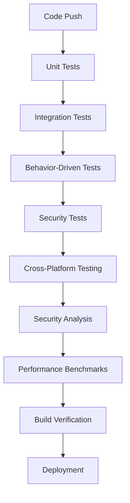

# CI/CD Pipeline Integration

## 🚀 **Overview**

This document describes the comprehensive CI/CD pipeline integration for TimeMachine CLI, ensuring robust quality gates and automated testing across all environments.

## 🏗️ **Pipeline Architecture**

### **Multi-Stage Testing Strategy**



## 📋 **Test Suite Components**

### **1. Unit Testing Layer**
```yaml
- name: Run unit tests - Core
  run: go test -v -race -timeout=10m ./internal/core/...

- name: Run unit tests - Commands  
  run: go test -v -race -timeout=10m ./internal/commands/...

- name: Run unit tests - Security
  run: go test -v -race -timeout=10m ./internal/security/...
```

### **2. Integration Testing Layer**
```yaml
- name: Run integration tests
  run: go test -v -race -timeout=15m -run TestInit -run TestList -run TestShow -run TestInspect -run TestRestore -run TestClean -run TestErrorHandling
```

**Coverage**: All CLI commands with real binary execution, cross-command workflows, error handling scenarios

### **3. Behavior-Driven Testing Layer**
```yaml
- name: Run behavior-driven tests
  run: go test -v -race -timeout=15m -run TestDeveloperWorkflow
```

**Coverage**: Real user workflow scenarios, developer use cases, end-to-end validation

### **4. Comprehensive Security Testing**
```yaml
- name: Run comprehensive security tests
  run: |
    echo "🛡️ Path traversal protection tests..."
    go test -v -race -timeout=10m -run="TestSecurity" ./...
    echo "🔍 Property-based security tests..."
    go test -v -race -timeout=10m -run="TestProperty" ./...
    echo "🎯 Fuzzing-based security tests..."  
    go test -v -race -timeout=15m -run="TestFuzz" ./...
    echo "⚡ Security regression tests..."
    go test -v -race -timeout=10m -run="TestSecurityValidation" ./...
```

**Coverage**:
- **Path Traversal Protection**: Multi-layer validation testing
- **Property-Based Security**: Random input validation with 1000+ test cases
- **Fuzzing-Based Security**: Attack pattern detection and prevention
- **Security Regression**: Prevents previously fixed vulnerabilities from returning

## 🔒 **Security Quality Gates**

### **Automated Security Validation**
- **Input Validation Testing**: All user inputs validated against attack patterns
- **Path Security Testing**: Comprehensive path traversal prevention
- **Command Injection Testing**: Git hash and parameter validation
- **Static Security Analysis**: `gosec` security scanner integration

### **Security Test Categories**

#### **Path Traversal Protection**
```go
// Tests include:
"../../../etc/passwd"           // Basic Unix traversal
"..\\..\\..\\windows\\system32" // Windows traversal  
"..%2f..%2f..%2fetc%2fpasswd"   // URL encoded attacks
"..%c0%af..%c0%af..%c0%af"      // Unicode overlong encoding
"\\\\server\\share"             // UNC network paths
```

#### **Command Injection Prevention** 
```go
// Tests include:
"abc123; rm -rf /"              // Shell command injection
"abc123 && echo pwned"          // Command chaining
"abc123 | cat /etc/passwd"      // Pipe injection  
"$(whoami)"                     // Command substitution
"`id`"                          // Backtick execution
```

#### **Property-Based Security Testing**
```go
// Generates 1000+ random inputs to test security boundaries
func TestSecurityProperties(t *testing.T) {
    quick.Check(func(input string) bool {
        // Any user input should either be accepted safely or rejected clearly
        err := validateUserInput(input)
        return err != nil || isSafeInput(input)
    }, &quick.Config{MaxCount: 1000})
}
```

## 🌍 **Cross-Platform Testing**

### **Test Matrix**
```yaml
strategy:
  matrix:
    os: [ubuntu-latest, macos-latest, windows-latest]
    go-version: ['1.21', '1.24']
```

### **Platform-Specific Considerations**
- **Windows**: Path separator handling, drive letter validation
- **macOS**: Case sensitivity, filesystem permissions
- **Linux**: Security validation, symlink handling

## 📊 **Quality Metrics**

### **Test Coverage Requirements**
- **Unit Tests**: >90% code coverage
- **Integration Tests**: All CLI commands covered
- **Security Tests**: All attack vectors covered
- **Behavior Tests**: All user workflows covered

### **Performance Benchmarks**
- **Startup Time**: <100ms for CLI commands
- **Snapshot Creation**: <1s for typical project
- **Memory Usage**: <50MB during operations

### **Security Standards**
- **Zero Security Test Failures**: All security tests must pass
- **OWASP Compliance**: Following OWASP 2025 guidelines
- **Static Analysis**: `gosec` scanner with zero high-severity issues

## 🔄 **Continuous Integration Workflow**

### **On Every Push/PR:**
1. **Code Quality Validation**
   - `go mod tidy` verification
   - `go vet` static analysis
   - Dependency verification

2. **Comprehensive Testing**
   - Unit tests with race detection
   - Integration tests with real binaries
   - Behavior-driven user workflow tests
   - Security validation and fuzzing tests

3. **Security Analysis**
   - Property-based security testing
   - Static security analysis (`gosec`)
   - Security regression testing
   - Attack pattern validation

4. **Cross-Platform Verification**
   - Multi-OS testing (Ubuntu, macOS, Windows)
   - Multi-Go version compatibility
   - Binary build verification

5. **Performance Validation**
   - Benchmark execution
   - Memory usage validation
   - Performance regression detection

### **Security-First Approach**
- **Fail Fast**: Any security test failure stops the pipeline
- **Comprehensive Coverage**: All security tests must pass before deployment
- **Regression Prevention**: Previously fixed vulnerabilities tested continuously
- **Attack Pattern Updates**: Security tests updated with new threat patterns

## 🛠️ **Development Workflow Integration**

### **Pre-Commit Testing**
```bash
# Recommended pre-commit hook
go test -race ./...                    # Unit tests
go test -run TestDeveloper ./...       # Behavior tests  
go test -run TestSecurity ./...        # Security tests
gosec ./...                           # Static analysis
```

### **Local Development**
```bash
# Full test suite
make test-all

# Security-focused testing
make test-security

# Performance benchmarks
make benchmark
```

### **Quality Gates**
- **All Tests Pass**: No test failures allowed
- **Security Clean**: Zero security vulnerabilities
- **Coverage Maintained**: Test coverage must not decrease
- **Performance Stable**: No performance regressions

## 📈 **Monitoring and Reporting**

### **Automated Reports**
- **Test Results**: Comprehensive test execution reports
- **Coverage Reports**: Code coverage analysis and trends
- **Security Reports**: `gosec` security analysis results
- **Performance Reports**: Benchmark results and trends

### **Artifact Management**
- **Security Scan Results**: JSON reports uploaded to artifacts
- **Coverage Reports**: HTML coverage reports
- **Binary Artifacts**: Cross-platform binaries for testing
- **Documentation**: Generated documentation updates

## 🎯 **Success Metrics**

### **Quality Indicators**
- **Zero Security Vulnerabilities**: All security tests passing
- **High Test Coverage**: >90% code coverage maintained
- **Fast Feedback**: CI pipeline completes in <10 minutes
- **Cross-Platform Compatibility**: All platforms supported

### **Security Assurance**
- **Attack Resistance**: All known attack patterns blocked
- **Input Validation**: 100% of user inputs validated
- **Regression Prevention**: Previously fixed issues stay fixed
- **OWASP Compliance**: Following current security guidelines

---

## 💡 **Best Practices**

1. **Security-First Development**: Every feature includes security tests
2. **Comprehensive Coverage**: Test real user scenarios, not just code paths
3. **Fail Fast**: Catch issues early in the development cycle
4. **Documentation**: Keep security documentation updated
5. **Monitoring**: Track security metrics and trends

This CI/CD integration ensures **enterprise-grade quality and security** for TimeMachine CLI while maintaining developer productivity and fast feedback cycles.